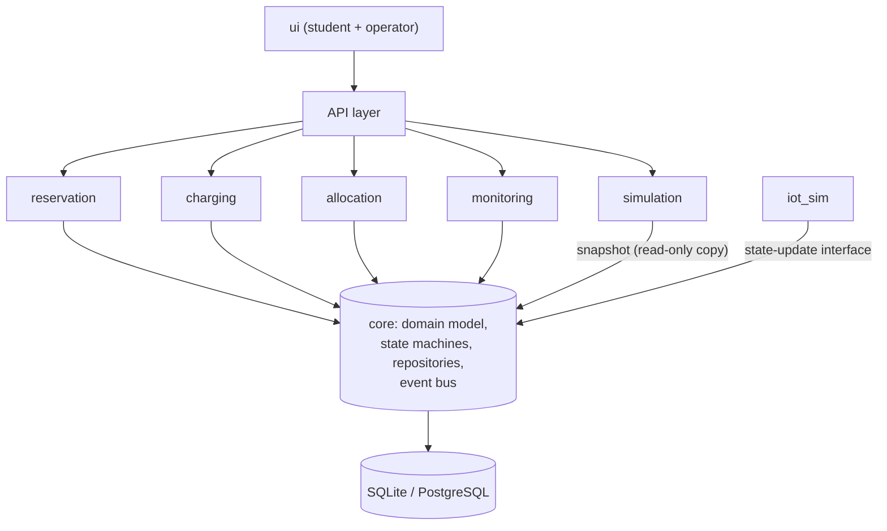

# Tech Stack Proposal

> **Status:** Proposed (D-002) · **Owner:** M1 · **Date:** 2026-10-05 · **Team decision target:** 2026-10-09
> This is a recommendation, not a decision. It assumes most team members can work in Python. **Run a quick poll of the team's skills before accepting** (see section 7).

## 1. Selection criteria

| Criterion | Why it matters here |
|---|---|
| Team familiarity | 8 people, ~7 weeks; no time to learn a new language. |
| Speed of development | Many modules must integrate in two sprints. |
| Testability | Rubric weights testing at 10% and demands technique-based test cases. |
| Typing and structure | CONTRIBUTING requires explicit types and clear module interfaces. |
| Easy to run from a clean clone | NFR-14: ≤ 15 minutes, ≤ 5 commands. |
| Fit for concurrency and consistency | NFR-06 to NFR-09 (no double booking, atomic operations). |
| Simulation support | What-if needs a state copy and deterministic runs (NFR-12, NFR-13). |

## 2. Recommended stack

| Layer | Choice | Reason | Main alternative |
|---|---|---|---|
| Language | Python 3.12 | Fast to write, strong testing ecosystem, easy simulation and seeded randomness. | Java 21 (Spring Boot): stronger typing, heavier setup. |
| API framework | FastAPI + Pydantic | Typed request/response models, automatic validation (NFR-18) and OpenAPI docs that double as the interface spec for other modules. | Django REST Framework; Flask. |
| Persistence | SQLAlchemy 2.x with SQLite for development and demo | Zero-install database, reproducible from a clean clone; same code can target PostgreSQL later. | PostgreSQL (via Docker): better concurrency, more setup. |
| Consistency approach | Transactions plus optimistic locking (version column) on Vehicle, ParkingSpace, ChargingPoint, Reservation | Meets NFR-06 and NFR-09 without a distributed lock manager. | Pessimistic row locks (needs PostgreSQL). |
| Events | In-process event bus inside `core` (publish/subscribe) | Lets monitoring and allocation react to state changes without importing each other. | Message broker (overkill for one deployment, A-08). |
| What-if isolation | Snapshot of state loaded into an in-memory repository that implements the same repository interface | Isolation by construction (NFR-12): the simulation never holds a connection to the operational store. | Copy-on-write database file. |
| Frontend | React + Vite + TypeScript, polling the REST API (SSE if time allows) | Common skill set; component reuse for student and operator screens. | Server-rendered Jinja2 + HTMX (fewer moving parts); Streamlit (fastest, least flexible). |
| Tests | pytest, pytest-cov | Parametrized tests fit equivalence partitioning and boundary-value tables; a marker per `TC-xxx`. | unittest. |
| Lint / format / types | ruff, mypy | Enforces CONTRIBUTING section 9 (rules 10, 11). | flake8 + black. |
| Dependencies | `pyproject.toml` with a lock file (e.g. `uv` or `pip-compile`); `package-lock.json` for the frontend | Pinned versions (CONTRIBUTING 9.12). Exact versions are fixed when the project is scaffolded. | `requirements.txt` with `==` pins. |
| CI | GitHub Actions: ruff, mypy, pytest, import-boundary check | Runs on every PR; since GitHub Free + private repo cannot require status checks (D-001), the reviewer/Lead checks the CI result manually before approving/merging. Add after the first scaffold. | None. |
| Diagrams | Mermaid for sequence/state/activity (renders on GitHub); draw.io or PlantUML for architecture, class diagram and ERD | Source files stay in the repo next to exported images. | — |
| Test-case management | Markdown/CSV tables in `docs/testing/` plus pytest markers carrying the `TC-xxx` ID | Keeps tests, IDs and traceability sheet in one repo. | External tool (extra cost). |

## 3. Architecture direction (to be finalized by 2026-10-26)

Modular monolith. `core` owns all hub, vehicle, parking and charging-point state. Other modules call `core` for reads and for validated state changes, and react to domain events. `iot_sim` only calls the `core` state-update interface. `simulation` works on a snapshot.

Trade-offs to discuss in the architecture document:

- **Benefit:** one process, simple consistency (transactions), easy to run and test.
- **Limitation:** not physically distributed (A-08); throughput limited to one node. Stated as a limitation in the report.
- **Alternative considered:** microservices per module. Rejected for this project because of coordination cost, difficulty of atomic multi-entity operations (NFR-09) and the 7-week schedule.

## 4. Repository and import layout

The structure mandated by README and CONTRIBUTING is kept (`src/core`, `src/reservation`, ..., `src/iot_sim`, `src/ui`). For Python this implies:

- Put `src` on the import path (e.g. `pythonpath = ["src"]` in the pytest configuration), so modules import each other as `core`, `reservation`, ...
- `src/ui` holds the frontend application; the API layer can live under `src/core/api` or a dedicated `src/api` package. **Decide in the architecture document**; changing the layout needs a `DECISIONS.md` entry.
- Tests mirror modules: `tests/<module>/`, with integration tests in `tests/integration/`.
- An import-boundary check enforces NFR-22 (no module imports another module's internals).

## 5. Development environment

- Python virtual environment in `.venv/` (ignored by git).
- VS Code as the common editor, with shared settings documented in the README rather than committed (`.vscode/` is ignored by CONTRIBUTING 11.3).
- `.gitattributes` fixes line endings to LF so that Windows, macOS and Linux machines produce the same diffs.
- `.env` created from `.env.example`; thresholds and seeds come from configuration, not hard-coded values (CONTRIBUTING 9.3).
- Optional: `pre-commit` hooks running ruff and mypy before each commit.

## 6. Risks

| Risk | Mitigation |
|---|---|
| Team is not comfortable with Python or TypeScript | Run the skills poll first; fall back to HTMX (no separate frontend toolchain) or to another language the majority knows. |
| SQLite limits concurrent writers | Enable write-ahead logging; keep transactions short; PostgreSQL via Docker as a documented upgrade path. |
| Frontend work (M7) blocks on API | Publish the OpenAPI schema early (Core API spec v1 by 2026-10-20) and use mock data. |
| Version drift between machines | Lock files, pinned versions, same Python minor version (3.12). |

## 7. Questions for the team (decide by 2026-10-09)

1. Which backend language do most members know? (Python / Java / JavaScript-TypeScript / other)
2. Frontend: React + Vite, or server-rendered pages with HTMX? (M7 has the strongest voice.)
3. Database: SQLite only, or SQLite for dev and PostgreSQL for the demo?
4. Is everyone able to run Docker? (Only needed if PostgreSQL is chosen.)
5. Do we add CI (GitHub Actions) from the first scaffold commit?

Once decided, record the outcome in `docs/DECISIONS.md` (update D-002 to Accepted) and fill the "Tech Stack" and "Getting Started" sections of the README.
