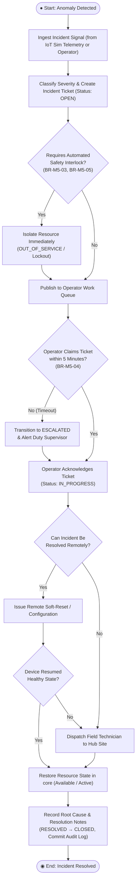

```mermaid
flowchart TD
    START(["● Start: Anomaly Detected"]) --> INTAKE["Ingest Incident Signal (from IoT Sim Telemetry or Operator)"]
    INTAKE --> CREATE["Classify Severity & Create Incident Ticket (Status: OPEN)"]

    CREATE --> COND_INTERLOCK{"Requires Automated<br/>Safety Interlock?<br/>(BR-M5-03, BR-M5-05)"}
    COND_INTERLOCK -->|"Yes"| LOCK["Isolate Resource Immediately<br/>(OUT_OF_SERVICE / Lockout)"]
    COND_INTERLOCK -->|"No"| ALERT["Publish to Operator Work Queue"]
    LOCK --> ALERT

    ALERT --> COND_TIME{"Operator Claims Ticket<br/>within 5 Minutes?<br/>(BR-M5-04)"}
    COND_TIME -->|"No (Timeout)"| ESCALATE["Transition to ESCALATED<br/>& Alert Duty Supervisor"]
    COND_TIME -->|"Yes"| CLAIM["Operator Acknowledges Ticket<br/>(Status: IN_PROGRESS)"]
    ESCALATE --> CLAIM

    CLAIM --> COND_FIX{"Can Incident Be<br/>Resolved Remotely?"}
    COND_FIX -->|"Yes"| RESET["Issue Remote Soft-Reset / Configuration"]
    COND_FIX -->|"No"| TECH["Dispatch Field Technician to Hub Site"]

    RESET --> VERIFY{"Device Resumed<br/>Healthy State?"}
    VERIFY -->|"Yes"| RESTORE["Restore Resource State in core (Available / Active)"]
    VERIFY -->|"No"| TECH
    TECH --> RESTORE

    RESTORE --> CLOSE["Record Root Cause & Resolution Notes<br/>(RESOLVED → CLOSED, Commit Audit Log)"]
    CLOSE --> END_NODE(["◉ End: Incident Resolved"])
```