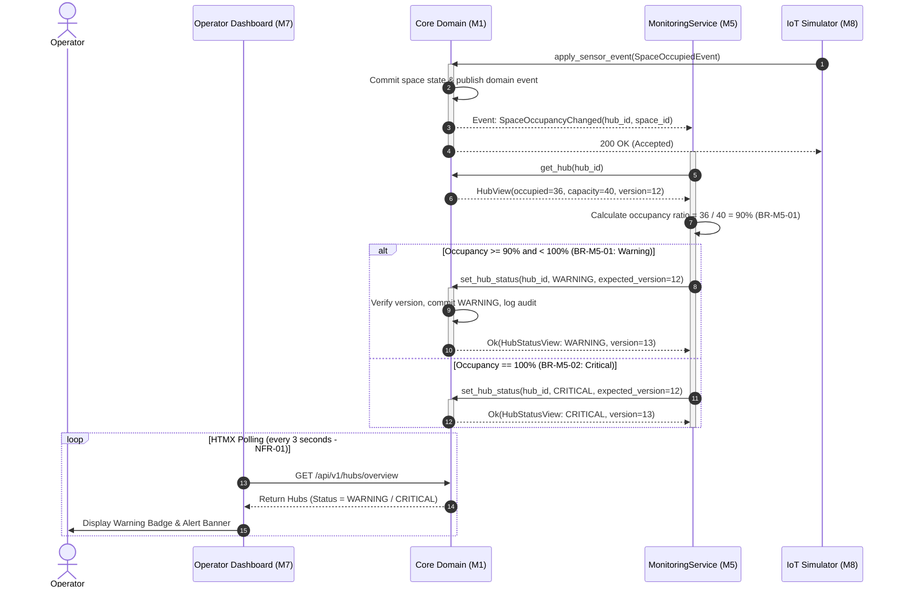

```mermaid
sequenceDiagram
    autonumber
    actor Operator as Operator
    participant UI as Operator Dashboard (M7)
    participant Core as Core Domain (M1)
    participant M5 as MonitoringService (M5)
    participant IoT as IoT Simulator (M8)

    %% 1. Telemetry Intake
    IoT->>Core: apply_sensor_event(SpaceOccupiedEvent)
    activate Core
    Core->>Core: Commit space state & publish domain event
    Core-->>M5: Event: SpaceOccupancyChanged(hub_id, space_id)
    Core-->>IoT: 200 OK (Accepted)
    deactivate Core

    %% 2. Evaluation & Status Transition
    activate M5
    M5->>Core: get_hub(hub_id)
    Core-->>M5: HubView(occupied=36, capacity=40, version=12)

    M5->>M5: Calculate occupancy ratio = 36 / 40 = 90% (BR-M5-01)

    alt Occupancy >= 90% and < 100% (BR-M5-01: Warning)
        M5->>Core: set_hub_status(hub_id, WARNING, expected_version=12)
        activate Core
        Core->>Core: Verify version, commit WARNING, log audit
        Core-->>M5: Ok(HubStatusView: WARNING, version=13)
        deactivate Core
    else Occupancy == 100% (BR-M5-02: Critical)
        M5->>Core: set_hub_status(hub_id, CRITICAL, expected_version=12)
        activate Core
        Core-->>M5: Ok(HubStatusView: CRITICAL, version=13)
        deactivate Core
    end
    deactivate M5

    %% 3. UI Synchronization
    loop HTMX Polling (every 3 seconds - NFR-01)
        UI->>Core: GET /api/v1/hubs/overview
        Core-->>UI: Return Hubs (Status = WARNING / CRITICAL)
        UI->>Operator: Display Warning Badge & Alert Banner
    end
```

