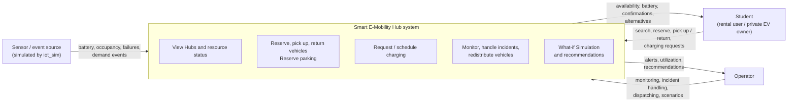

# 1. Introduction

> **Status:** Draft v0.1 · **Owner:** M1 · **Date:** 2026-10-05
> Sections marked *(to be refined)* depend on inputs from other members (use cases, business rules).
> Assumption IDs (`A-xx`) and decision IDs (`D-xxx`) refer to `docs/DECISIONS.md`.

---

## 1.1 Problem context

The VNU-HCM Urban Area brings together several universities, student dormitories, libraries, service facilities and public transport hubs. In the future, students are expected to arrive through Metro Line 1 and continue their journey on shared electric bicycles, scooters or motorcycles between campuses and functional areas.

This creates a coordination problem that goes beyond managing a fleet of vehicles. Three kinds of resources are shared, limited and interdependent:

- **Vehicles**, whose usefulness depends on their battery level and condition.
- **Parking spaces**, which limit where vehicles can be left and how many can be accepted at a Hub.
- **Charging points**, which limit how fast low-battery vehicles can become available again.

Demand for these resources is uneven in time and space. A burst of arrivals at the Metro station can empty one Hub of vehicles while another Hub fills up and runs out of parking spaces. Low-battery vehicles can occupy charging points while vehicles that are about to be reserved wait for a charge. Without a system that keeps an accurate, shared view of this state and coordinates decisions, users meet unavailable vehicles and full Hubs, and operators discover problems late.

## 1.2 Objectives

The project builds a **Smart E-Mobility Hub** system that manages and coordinates a network of Mobility Hubs in the VNU-HCM Urban Area. Each Hub consists of parking spaces, charging points and electric vehicles.

| ID | Objective | Related capabilities |
|---|---|---|
| O-1 | Give students and operators an accurate, near-real-time view of every Hub's vehicles, parking spaces and charging points. | FR-01, FR-02, FR-08 |
| O-2 | Let students find, reserve, pick up and return rental vehicles, and reserve parking and charging for private vehicles, without resource conflicts. | FR-02 to FR-05, FR-07 |
| O-3 | Use limited charging capacity efficiently by giving priority to vehicles with low battery or imminent use, reducing congestion and waiting. | FR-06, FR-11 |
| O-4 | Let operators detect Hubs approaching capacity, handle incidents (vehicle failures, unavailable charging points) and redistribute vehicles between Hubs. | FR-08, FR-09, FR-10 |
| O-5 | Let operators evaluate hypothetical scenarios on a copy of the current state and receive coordination recommendations before changing the real system. | FR-12 |
| O-6 | Follow a complete software engineering process in which requirements, design, implementation and tests stay consistent and traceable through shared IDs (`FR`, `NFR`, `BR`, `UC`, `TC`). | All |

## 1.3 Scope

### In scope

The system supports the twelve core capabilities of the assignment (`FR-01` to `FR-12`):

1. View Mobility Hubs and their current resource status.
2. Find suitable rental vehicles and view availability and battery information.
3. Reserve rental vehicles.
4. Pick up and return rental vehicles.
5. Reserve parking spaces.
6. Request or schedule charging services.
7. Support private-vehicle users in reserving parking and charging resources.
8. Monitor vehicles, parking capacity, charging points and Hub utilization.
9. Handle operational incidents.
10. Coordinate or redistribute rental vehicles among Hubs.
11. Coordinate charging priorities and schedules.
12. Run What-if Simulation scenarios and generate coordination recommendations.

The report concentrates on state management, resource allocation, reservation handling, charging scheduling, vehicle dispatching, event handling and scenario simulation.

### Out of scope

- Physical hardware (sensors, chargers, vehicle firmware). State comes from simulated data.
- Sophisticated 3D or map-based interfaces, route planning and in-trip tracking (A-01, A-02).
- Payment, pricing, billing, penalties and ratings (A-07).
- Integration with university identity systems or the real Metro operator (A-06).

## 1.4 Stakeholders and actors *(to be refined by M2 in Requirements Analysis)*

| Stakeholder / actor | Role | Main goals | Interaction with the system |
|---|---|---|---|
| Student (rental user) | Primary actor | Find a nearby vehicle with enough battery, reserve it, pick up and return it with little effort. | Direct (student interface) |
| Private EV owner (student) | Primary actor | Secure a parking space and a charging slot at a chosen Hub in advance. | Direct (student interface) |
| Operator | Primary actor | Keep the network usable: monitor, resolve incidents, redistribute vehicles, plan with What-if Simulation. | Direct (operator dashboard) |
| Sensor / event source | Secondary actor (external) | Report battery levels, parking occupancy, charging-point failures and demand events. | Sends events through the `core` state-update interface; represented by the IoT simulator (D-004) |
| VNU-HCM management | Stakeholder | Efficient use of shared infrastructure, good service for students. | Indirect (reports and recommendations) |
| Course lecturer / evaluators | Stakeholder | A consistent, well-justified software engineering process. | Indirect (report, presentation, recorded demo) |

## 1.5 Assumptions

The full list, with owners and impact, is in `docs/DECISIONS.md`. The assumptions that shape the system most are:

- Rental trips are hub-to-hub; vehicles must be returned to a parking space at a Hub (A-01).
- Three rental vehicle types exist, and every charging point can charge all of them (A-03).
- A charging point serves one vehicle at a time with a fixed power rate (A-04).
- Authentication is simplified to seeded accounts with student and operator roles (A-06).
- The system runs as one deployment; the distributed nature of the environment is represented by logically separated modules and Hubs (A-08).
- The reference dataset for quality targets is 10 Hubs, 400 parking spaces, 61 charging points, 250 rental vehicles, 100 registered private EVs and 100 concurrent sessions (A-11). Its full specification is in `docs/requirements/reference-dataset.md`.

## 1.6 Constraints

| Type | Constraint |
|---|---|
| Data source | No physical hardware is used. Vehicle, parking and charging-point state comes from simulated data produced by the IoT simulator and is reproducible from a seed. |
| Resources | Parking spaces, charging points and vehicle batteries are finite. A resource cannot be allocated to two users at the same time, and a Hub's capacity must never be exceeded. |
| State | The states of vehicles, reservations, charging sessions and incidents change only along the transitions allowed by their state machines. |
| Interface | The student and operator interfaces are screen-based and do not include 3D or map-based rendering. |

## 1.7 System boundary

The figure shows the system as a black box with its external actors. The detailed component architecture is given in the System Architecture section.

| Inside the boundary | Outside the boundary |
|---|---|
| Domain state of Hubs, vehicles, parking spaces, charging points | Physical vehicles, sensors and chargers |
| Reservation, trip, charging, allocation and dispatching logic | Payment and billing |
| Monitoring, alerts and incident handling | University identity systems, Metro operations |
| What-if Simulation on a copy of the state | Map rendering and route planning |
| Student and operator interfaces | Generation of real-world events (represented by `iot_sim`, treated as an external source, D-004) |

## 1.8 Organization of the report

| Report section | Rubric component |
|---|---|
| 1 Introduction | Introduction |
| 2 Requirements Analysis (2.1 Stakeholders and Actors, 2.2 FR, 2.3 NFR, 2.4 Business Rules and Constraints, 2.5 Use-case Modeling) | Requirements Analysis |
| 3.1 Software Architecture | System Architecture |
| 3.2 Structural and Data Design | Structural and Data Design |
| 3.3 Behavioral and Interaction Design | Behavioral and Interaction Design |
| 3.4 User-interface Design | UI Design |
| 3.5 What-if Simulation and Coordination Design | What-if Simulation and Coordination Design |
| 4 Implementation (4.1 to 4.4) | Implementation |
| 5 Testing and Validation (5.1 to 5.4) | Testing and Validation |
| 6 Evaluation and Conclusion (6.1 AI Usage Declaration) | Evaluation, Conclusion, and AI Declaration |

Requirement, rule, use-case and test IDs are used consistently across all sections so that each requirement can be traced to its design elements, code and tests.
